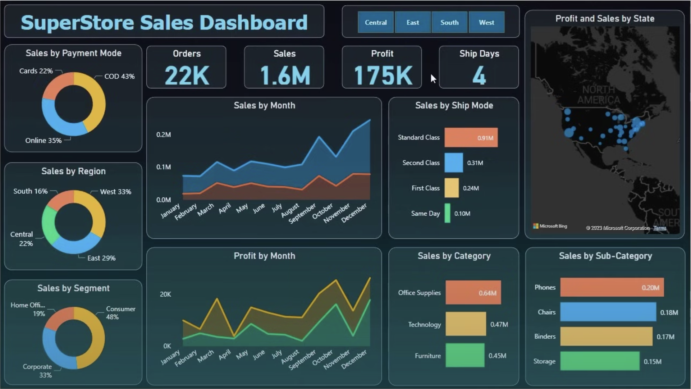

# Business Analysis Dashboard using PowerBI

## Introduction
- This project involves creating a dynamic dashboard using PowerBI to analyze business metrics such as sales, profit, and timeline. 
- The primary objective is to contribute to business success through data analysis, emphasizing time series analysis for accurate sales forecasting and valuable insights.

## Problem Statement
- Developed a PowerBI dashboard to present detailed analyses of sales, profit, and timeline.
- Utilized time series analysis to enhance sales forecasting for informed decision-making.

## Tech Used
- PowerBI

## Learnings
- Incorporated advanced data analysis techniques, with a specialization in time series analysis, to deliver valuable insights and accurate sales forecasting.
- The interactive dashboard creation contributed significantly to driving business success.
- Learned about DAX queries and their execution in PowerBI, use of various charts and their representation, along with tables representation and how the data is oragnized when fetched from CSV files.

## Screenshots

<table>
  <tr>
    <td></td>
    <td></td>
  </tr>
</table>

## License
[MIT](https://choosealicense.com/licenses/mit/)
